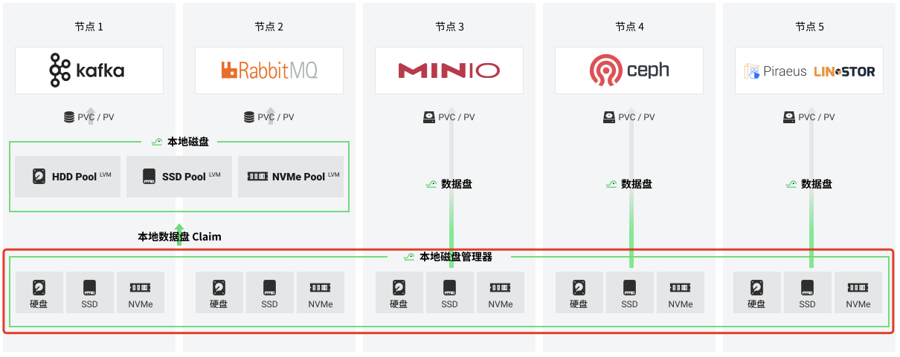

# Local Disk Manager (LDM)

Local Disk Manager (LDM) is one of modules of HwameiStor. `LDM` is to simplify the management of disks on nodes. It can abstract the disk on the node into a resource and can be monitored and managed. It's a daemon that will be deployed on each node, then detect the disk on the node, abstract it into local disk (LD) resources and save it to kubernetes.



At present, the LDM project is still in the `alpha` stage.

## Concepts

LocalDisk(LD): LDM abstracts disk resources into objects in k8s. A `LD` resource object represents the disk resources on the host.

LocalDiskClaim (`LDC`): The way to use disk, Users can add a description of the disk to select the disk to be used.

> At present, LDC supports the following disk description options:
> 
> - NodeName
> - Capacity
> - DiskType (e.g. HDD/SSD)

## Usage

If you want to entirely deploy HwameiStor, please refer to [Usage With Helm Chart](../02installation/01helm-chart.md).

If you just want to deploy LDM separately, you can refer to the following installation steps.

## Install Local Disk Manager

### 1. Clone this repo to your machine:

```bash
$ git clone https://github.com/hwameistor/local-disk-manager.git
```

### 2. Change to deploy directory:

```bash
$ cd deploy
```

### 3. Deploy CRDs and run local-disk-manager

#### 3.1 Deploy LD and LDC CRDs

```bash
$ kubectl apply -f deploy/crds/
```

#### 3.2 Deploy RBAC CRs and operators

```bash
$ kubectl apply -f deploy/
```

### 4. Get LocalDisk infomation

```bash
$ kubectl get localdisk
10-6-118-11-sda    10-6-118-11                             Unclaimed
10-6-118-11-sdb    10-6-118-11                             Unclaimed
```

Get locally discovered disk resource information. There are four columns of information.

- **NAME:** represents how this disk is displayed in the cluster resources.
- **NODEMATCH:** indicates which host this disk is on.
- **CLAIM:** indicates which `Claim` statement this disk is used by.
- **PHASE:** represents the current state of the disk.

Use `kuebctl get localdisk <name> -o yaml` to view more information about disks.

### 5. Claim Available Disks

#### 5.1 Apply a LocalDiskClaim

```bash
# kubectl apply -f deploy/samples/hwameistor.io_v1alpha1_localdiskclaim_cr.yaml
```

Allocate available disks by issuing a disk usage request. In the description of the request, you can add disk requirements, such as disk type and disk capacity.

#### 5.2 Get LocalDiskClaim infomation

```bash
# kubectl get localdiskclaim <name>
```

Check the status of `Claim`. If there is a disk available, you will see that the status is `Bound` and the status is on the corresponding localdisk is Claimed and points to the claim that references the disk.

## Roadmap

| Feature| Status| Release| Description
|:----------|----------|----------|----------
| CSI for disk volume| Planed| | `CSI` driver for provisioning Local PVs with bare `Disk`
| Disk management| Planed| | Disk management, disk allocation, disk event aware processing
| Disk health management| Planed| | Disk health management
| HA disk Volume| Planed| | HA disk Volume

## Feedback

If any question, submit your feedback and issue via [Issues](https://github.com/hwameistor/local-disk-manager/issues).